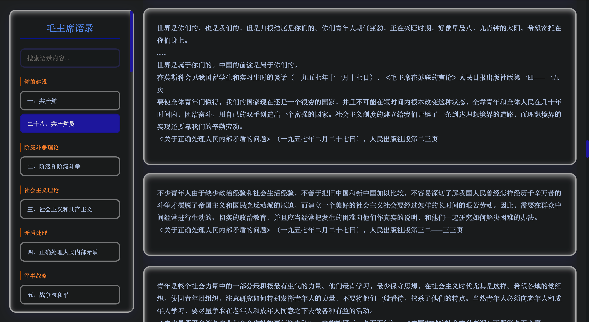

# 毛主席语录网页版 | Mao Zedong Quotations Web Reader

> 基于 JSON 数据生成的交互式《毛主席语录》阅读网页
> Interactive web reader for Mao Zedong Quotations based on JSON data

[](https://github.com/1998x-stack/maoZeDongYuLu/actions/workflows/deploy.yml)
[](https://creativecommons.org/licenses/by-nc/4.0/)
[](https://1998x-stack.github.io/maoZeDongYuLu/)



*预览图：Claymorphism 设计风格的交互式语录阅读器*

## 🌟 功能特性 | Features

### 📚 章节导航 | Chapter Navigation
- **分类浏览**：左侧导航栏按分类（如"党的建设"、"军事"等）组织章节
- **快速跳转**：点击章节按钮立即加载内容
- **视觉反馈**：当前选中章节高亮显示

*Categorized navigation with instant content loading and visual feedback*

### 🔍 智能搜索 | Smart Search
- **全文搜索**：实时搜索所有章节内容
- **高亮结果**：匹配关键词橙色高亮显示
- **搜索统计**：显示搜索结果数量
- **快捷操作**：支持 Escape 键清除搜索

*Full-text search with keyword highlighting and search statistics*

### ♿ 无障碍访问 | Accessibility
- **语义化HTML**：正确使用 `<nav>`, `<main>`, `<article>` 标签
- **ARIA支持**：`aria-live`, `aria-busy`, `aria-current` 等属性
- **键盘导航**：完整支持 Tab, Enter, Space, Escape 键
- **屏幕阅读器**：兼容 NVDA, JAWS, VoiceOver

*Semantic HTML with full ARIA support and keyboard navigation*

### 🎨 设计特色 | Design Highlights
- **Claymorphism 风格**：软萌3D效果，圆润边角
- **响应式设计**：完美适配桌面、平板、手机
- **性能优化**：防抖搜索、懒加载、平滑过渡
- **阅读友好**：优化字体、行距、对比度

*Claymorphism design with responsive layout and performance optimizations*

### 💻 键盘快捷键 | Keyboard Shortcuts
- `Tab` - 在导航元素间切换
- `Enter`/`Space` - 激活按钮
- `Escape` - 清除搜索
- `↑`/`↓` - 章节列表导航

## 🚀 快速开始 | Quick Start

### 在线访问 | Online Access

🌐 **GitHub Pages**: https://1998x-stack.github.io/maoZeDongYuLu/

无需安装，直接在浏览器中访问即可使用。

### 本地运行 | Local Development

1. **克隆仓库**
   ```bash
   git clone https://github.com/1998x-stack/maoZeDongYuLu.git
   cd maoZeDongYuLu
   ```

2. **启动HTTP服务器**（必需，因浏览器安全限制）
   ```bash
   python3 -m http.server 8000
   ```

3. **访问网页**
   打开浏览器访问 `http://localhost:8000`

## 📁 项目结构 | Project Structure

```
maozedongyulu/
├── index.html              # 主网页文件 | Main HTML file
├── jsons/                  # JSON数据目录 | JSON data directory
│   ├── 01_目录.json        # 目录 | Table of Contents
│   ├── 02_《毛主席语录》再版前言.json
│   ├── 03_一、共产党.json
│   └── ...（共35个章节）
├── assets/                 # 资源文件 | Assets
│   └── screenshot.png      # 预览截图 | Screenshot
├── metadata.json           # 元数据 | Metadata
├── 毛主席语录.json         # 完整数据 | Complete data
├── .github/workflows/      # GitHub Actions
│   └── deploy.yml          # 部署配置 | Deployment config
└── README.md               # 项目文档 | Documentation
```

## 🛠️ 技术栈 | Tech Stack

### 设计系统 | Design System
- **设计模式**：Feature-Rich Showcase
- **视觉风格**：Claymorphism（软萌3D）
- **配色方案**：
  - 主色：`#4F46E5` (靛蓝)
  - 辅色：`#818CF8` (浅蓝)
  - 强调色：`#F97316` (橙红)
  - 背景：`#EEF2FF` (淡紫)
- **字体**：Noto Serif SC + EB Garamond

### 前端技术 | Frontend
- **纯HTML/CSS/JavaScript**：无依赖，轻量快速
- **现代CSS**：自定义属性、Flexbox、Grid、Backdrop-filter
- **渐进增强**：JavaScript失败时仍可显示基本内容

## 📱 浏览器兼容性 | Browser Compatibility

| 浏览器 | 最低版本 | 状态 |
|--------|---------|------|
| Chrome | 90+ | ✅ 完全支持 |
| Firefox | 88+ | ✅ 完全支持 |
| Safari | 14+ | ✅ 完全支持 |
| Edge | 90+ | ✅ 完全支持 |
| 移动端浏览器 | - | ✅ 响应式设计 |

## 📖 数据来源 | Data Source

- **标题**：毛主席语录 | Mao Zedong Quotations
- **作者**：毛泽东 | Mao Zedong
- **语言**：中文 | Chinese
- **UUID**：`urn:uuid:273fd756-62f2-4858-8d67-99e08f24bba9`

## 🎛️ 配置与定制 | Configuration

### 样式定制
所有样式使用CSS自定义属性，可通过修改 `:root` 中的变量调整：

```css
:root {
    --primary: #4F46E5;    /* 主色 */
    --secondary: #818CF8;  /* 辅色 */
    --cta: #F97316;        /* 强调色 */
    --bg: #EEF2FF;         /* 背景色 */
    --text: #1E1B4B;       /* 文字色 */
}
```

### 部署配置
项目使用 GitHub Actions 自动部署到 GitHub Pages：
- **触发条件**：推送到 `main` 分支
- **部署分支**：`gh-pages`
- **访问地址**：`https://1998x-stack.github.io/maoZeDongYuLu/`

## 🤝 贡献 | Contributing

欢迎提交 Issue 和 Pull Request！

1. Fork 本仓库
2. 创建特性分支 (`git checkout -b feature/AmazingFeature`)
3. 提交更改 (`git commit -m 'Add some AmazingFeature'`)
4. 推送到分支 (`git push origin feature/AmazingFeature`)
5. 开启 Pull Request

## 📄 许可证 | License

本项目仅用于学习和研究目的。内容版权归原作者所有。

## 🔄 更新日志 | Changelog

### 📅 2026-04-07：v1.1.0 重大改进版本

#### ✨ 新增功能
- **搜索高亮**：搜索结果中的匹配关键词高亮显示
- **清除搜索**：搜索框添加清除按钮，支持Escape快捷键
- **加载动画**：章节加载时显示脉冲动画和状态提示
- **错误处理**：增强错误检测和友好的错误消息显示
- **ARIA实时区域**：动态内容更新时屏幕阅读器自动播报

#### ♿ 无障碍改进
- **键盘导航**：所有交互元素支持Tab键导航和Enter/Space激活
- **焦点指示**：键盘操作时显示清晰的焦点轮廓
- **ARIA属性**：完善aria-current、aria-busy、aria-live等属性
- **语义化HTML**：使用正确的HTML5语义标签

#### 📖 阅读体验优化
- **字体升级**：改用Noto Serif SC，专为中文优化的衬线字体
- **行高调整**：增加行高至1.7，提升长文本可读性
- **字体大小**：正文调整为17px，更适合屏幕阅读
- **字间距**：标题添加负字间距，提升视觉层次

#### 🔧 技术改进
- **防抖搜索**：300ms防抖避免频繁搜索
- **加载状态**：aria-busy属性准确反映加载状态
- **性能优化**：更高效的DOM操作和事件处理
- **代码质量**：更好的错误处理和模块化

#### 🐛 问题修复
- 修复了直接打开文件无法加载数据的问题
- 改进了移动端触摸体验
- 修复了搜索时可能出现的性能问题

### 📅 2026-04-07：v1.0.0 初始版本
- 完成基本功能和设计
- 实现章节导航和搜索功能
- 添加Claymorphism设计风格

## ⚠️ 注意事项 | Important Notes

由于浏览器安全限制（CORS），直接打开 `index.html` 文件（`file://` 协议）无法加载JSON数据。必须通过HTTP服务器访问。

**解决方案**：
- 使用 `python3 -m http.server 8000` 启动本地服务器
- 或使用 VS Code 的 Live Server 插件
- 或部署到任何静态网站托管服务

## 📞 联系方式 | Contact

- **项目地址**：https://github.com/1998x-stack/maoZeDongYuLu
- **问题反馈**：https://github.com/1998x-stack/maoZeDongYuLu/issues

---

<div align="center">

**⭐ 如果这个项目对你有帮助，请给个 Star！**<br>
*If this project is helpful, please give it a Star!*

</div>
